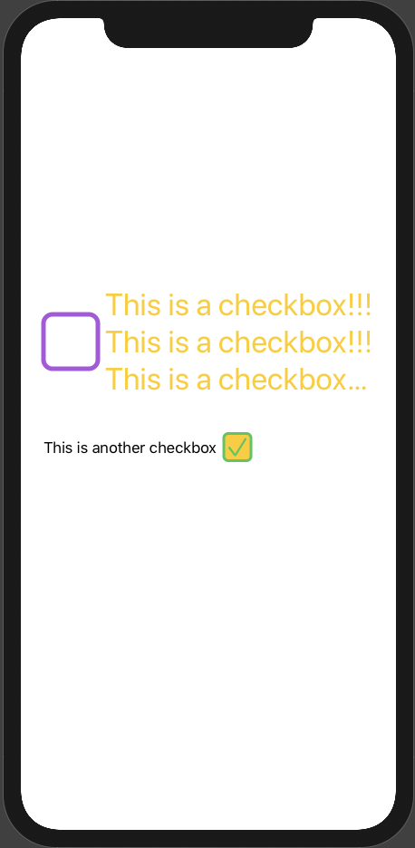

# CheckBox

A SwiftUI CheckBox component.



# Installation

Install through Swift Package Manager

# Example

## Example 1:

```
CheckBox(text:"This is a checkbox!!!This is a checkbox!!!This is a checkbox!!!This is a checkbox!!!This is a checkbox!!!This is a checkbox!!!", textPosition: .right,isChecked: false, appearance: style ).font(.largeTitle).padding().foregroundColor(.yellow).lineLimit(10)
```

## Example 2:

```
      CheckBox(text:"This is another checkbox", isChecked:true,appearance: style2, onCheck:{
        isChecked in
        print(isChecked)
      }).font(.body).padding()
```


# TODO:

1. Pass initial value for @State
2. Add event at the end, for example:

```
    CheckBox(Text("This is a checkbox")).onCheck() {

    }
```
3. Wrap text in {} at the end, for example:

```
    CheckBox() {
        Text("This is a checkbox")
    }.position(.right)
```


